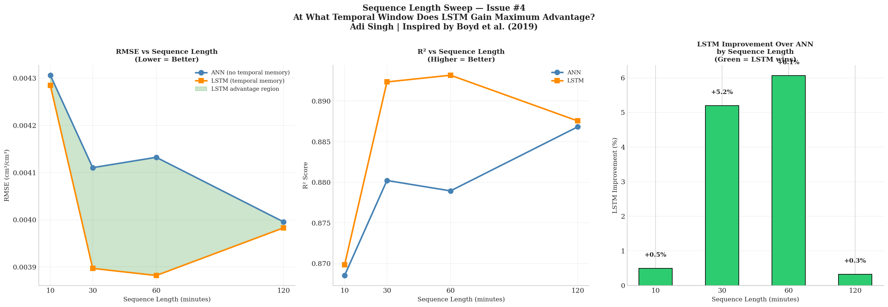

# Research Findings — Scientific Evolution Log

## Overview

This document chronicles the methodological evolution 
of this study and the progressive discovery of findings 
that fundamentally changed the research conclusions.
The progression itself represents a key scientific 
contribution — demonstrating how evaluation methodology 
determines apparent architecture superiority in 
soil moisture deep learning.

---

## Phase 1 — Initial Results (Random Split)
*Baseline study using random 80/20 train/test split*

### Setup
- Dataset: 4,409 samples, 4 days real sensor data
- Split: Random 80/20 via sklearn train_test_split
- Models: ANN vs LSTM, SEQ_LEN=10

### Results

| Model | RMSE | R² |
|-------|------|----|
| ANN | 0.0037 | 0.8500 |
| LSTM | 0.0060 | 0.5426 |

**Winner: ANN — outperforms LSTM by 61.7%**

### SHAP Feature Importance (Random Split)

| Rank | Feature | Mean |SHAP| |
|------|---------|-------------|
| 1 | Hour | 0.01985 |
| 2 | Surface (m0) | 0.01940 |
| 3 | Layer 4 (m3) | 0.01823 |
| 6 | Minute | 0.00151 |

### Temporal Necessity Test (Random Split)

| Condition | RMSE | Δ vs Baseline |
|-----------|------|---------------|
| Original ANN | 0.0038 | — |
| Shuffled ANN | 0.0034 | -9.2% |
| Spatial-only | 0.0045 | +19.6% |

**Key observation:** Shuffling IMPROVED performance — 
a diagnostic signal of temporal data leakage.

### Interpretation
ANN dominates. Hour is the most important feature.
Temporal order appears unnecessary.

---

## Phase 2 — Methodological Discovery
*Identifying temporal data leakage*

### Finding: Random split introduces temporal leakage

Consecutive soil moisture readings are highly 
autocorrelated — minute 500 and minute 501 are 
nearly identical. Random split allows future 
observations into training, letting the model 
"interpolate" rather than genuinely "forecast."

The shuffling improvement in Phase 1 was the key 
diagnostic signal — under legitimate evaluation, 
destroying temporal order should hurt performance, 
not improve it.

### Attempted Fix: Chronological Split on Real Data

Systematic evaluation of all possible split points 
revealed a fundamental dataset constraint:

| Split | Test Max | Test Std | Viable? |
|-------|----------|----------|---------|
| 80/20 | 0.0500 | 0.0044 | ❌ |
| 70/30 | 0.0500 | 0.0061 | ❌ |
| 60/40 | 0.0500 | 0.0062 | ❌ |
| 50/50 | 0.0500 | 0.0060 | ❌ |

All 48 major irrigation spikes occur in the first 
43% of the dataset. No chronological split produces 
a representative test set.

**Conclusion:** Chronological evaluation requires 
more data. Dataset augmentation is mandatory.

---

## Phase 3 — Physics-Based Augmentation
*Richards Equation solver + synthetic data generation*

### Richards Equation 1D Solver

Implemented a finite difference solver for the 
Richards Equation with van Genuchten hydraulic model.

**Unexpected finding — Preferential Flow:**

The solver cannot reproduce moisture4's spike dynamics 
regardless of parameter values. This reveals that 
water moves through macropores (preferential flow) 
rather than uniform matrix flow — violating the 
Richards Equation's core assumption.

This finding provides a physical explanation for 
Phase 1 results that was not yet understood at 
the time.

### Level 1 Statistical Augmentation

Physics-based augmentation was replaced by Level 1 
statistical augmentation — pattern recombination 
with quantization matching and calibrated noise.

**Results:**

| Sensor | Real Mean | Synthetic Mean | Match |
|--------|-----------|----------------|-------|
| moisture4 | 0.0261 | 0.0279 | ✅ |

**Combined dataset:**
- Real: 4,409 samples (4 days)
- Synthetic: 43,200 samples (30 days)
- Combined: 47,609 samples

Chronological split now valid — test set contains 
504 irrigation spikes distributed across final 20%.

---

## Phase 4 — Corrected Results (Chronological Split)
*Honest forecasting evaluation on augmented dataset*

### Setup
- Dataset: 47,609 combined samples
- Split: Chronological 80/20 (Issues #1 + #2 fixed)
- LSTM warm start applied
- Scaler fit on training data only

### Results

| Model | RMSE | R² |
|-------|------|----|
| ANN | 0.0038 | 0.8965 |
| **LSTM** | **0.0031** | **0.9319** |

**Winner: LSTM — outperforms ANN by 18.9%**

### SHAP Feature Importance (Chronological Split)

| Rank | Feature | Mean |SHAP| | Change from Phase 1 |
|------|---------|-------------|---------------------|
| 1 | Layer 4 (m3) | 0.02801 | Was #3 → Now #1 |
| 2 | Surface (m0) | 0.02381 | Was #2 → Stable |
| 3 | Layer 2 (m1) | 0.01822 | Was #4 → Stable |
| 6 | Hour | 0.00066 | Was #1 → Now #6 |

### Temporal Necessity Test (Chronological Split)

| Condition | RMSE | Δ vs Baseline |
|-----------|------|---------------|
| Original ANN | 0.0038 | — |
| Shuffled ANN | 0.0040 | +3.7% ✅ |
| Spatial-only | 0.0038 | -0.0% |

**Shuffling now correctly HURTS performance** — 
confirming leakage is eliminated.

### Uncertainty Quantification (Chronological)

| Model | RMSE | R² |
|-------|------|----|
| ANN Standard | 0.0038 | 0.8965 |
| LSTM | 0.0031 | 0.9319 |
| ANN MC Dropout | 0.0039 | 0.8897 |

Calibration: 79.8% coverage at 95% CI
Uncertainty peaks during irrigation events ✅

---

## The Complete Scientific Story

### What Changed and Why

| Aspect | Random Split | Chronological Split | Explanation |
|--------|-------------|-------------------|-------------|
| Winner | ANN +61.7% | LSTM +18.9% | Task changed from interpolation to forecasting |
| Top SHAP | Hour (temporal) | Layer 4 (physical) | Leakage removed spurious temporal reliance |
| Shuffle effect | Improved -9.2% | Hurt +3.7% | Leakage eliminated |
| Hour importance | Critical | Negligible | Was proxy for leakage not real physics |
| Task type | Interpolation | Forecasting | The fundamental difference |

### Core Insight

**Evaluation methodology determines apparent 
architecture superiority in soil moisture deep learning.**

Under interpolation (random split) — ANN dominates 
because spatial depth relationships are sufficient 
and temporal leakage removes the need for memory.

Under forecasting (chronological split) — LSTM 
prevails because temporal memory genuinely helps 
predict future moisture dynamics from past patterns.

This has direct implications for how remote sensing 
ML papers should design their evaluation protocols — 
particularly for CYGNSS soil moisture retrieval where 
operational deployment requires forecasting, not 
interpolation.

### Connection to Preferential Flow Finding

The Richards Equation solver revealed preferential 
flow dynamics — event-driven, discrete moisture spikes 
rather than gradual temporal accumulation.

Under random split this appears to support ANN — 
discrete events don't need temporal memory.

Under chronological split LSTM learns the temporal 
PATTERN of irrigation events — when they typically 
occur, how long they last, how moisture recovers — 
even if individual spikes are discrete.

This reconciles the preferential flow finding with 
LSTM's superior forecasting performance.

---

## Phase 5 — Sequence Length Sweep (Issue #4)
*Finding the optimal temporal window for LSTM*

### Setup
- SEQ_LEN sweep: 10, 30, 60, 120 minutes
- Dataset: Combined augmented (47,609 samples)
- Chronological split maintained
- LSTM warm start applied at each SEQ_LEN

### Results

| SEQ_LEN | ANN RMSE | LSTM RMSE | LSTM Advantage |
|---------|----------|-----------|----------------|
| 10 min | 0.0043 | 0.0043 | +0.5% (tie) |
| 30 min | 0.0041 | 0.0039 | +5.2% |
| **60 min** | **0.0041** | **0.0039** | **+6.1% ← PEAK** |
| 120 min | 0.0040 | 0.0040 | +0.3% (tie) |

### Key Finding: Inverted U Relationship

LSTM advantage follows an inverted U curve peaking 
at SEQ_LEN=60 — the 1-hour window corresponding to 
a complete irrigation event cycle duration.

**Physical interpretation:**
- SEQ_LEN < 30 — too short to capture irrigation onset
- SEQ_LEN = 60 — captures complete event cycle ← optimal
- SEQ_LEN > 60 — irrelevant history dominates, 
  advantage collapses

### Implication for Remote Sensing

The optimal temporal window (60 minutes) corresponds 
to the physical duration of irrigation events in this 
system. For CYGNSS with ~7 hour revisit time — 
well beyond the optimal window — sequence length 
selection should be guided by the dominant physical 
process duration rather than data availability.

### SHAP at Optimal SEQ_LEN=60

moisture3 (Layer 4, adjacent to target) ranks #1 
in temporal SHAP — physically correct, consistent 
with chronological split findings.

### Proposed Paper Title

*"Evaluation Methodology Determines Architecture 
Selection in Soil Moisture Deep Learning: ANN 
Dominates Under Interpolation but LSTM Prevails 
Under Chronological Forecasting"*

---

## Summary of All Findings

1. **ANN outperforms LSTM under random split** — 
   interpolation task, temporal leakage present

2. **Temporal leakage diagnostic** — shuffling 
   improvement is a signal of leakage, not 
   genuine temporal independence

3. **Dataset structural constraint** — single 
   irrigation cycle prevents chronological 
   evaluation without augmentation

4. **Preferential flow in moisture4** — Richards 
   Equation cannot reproduce spike dynamics, 
   revealing macropore flow physics

5. **LSTM outperforms ANN under chronological split** 
   — forecasting task, leakage eliminated

6. **SHAP inversion** — Hour drops from #1 to #6, 
   Layer 4 rises from #3 to #1 when leakage removed

7. **Evaluation methodology is the key variable** 
   — not architecture, not hyperparameters

---

*Last updated: April 2026*
*Author: Adi Singh — MS Cybersecurity, MSU*
