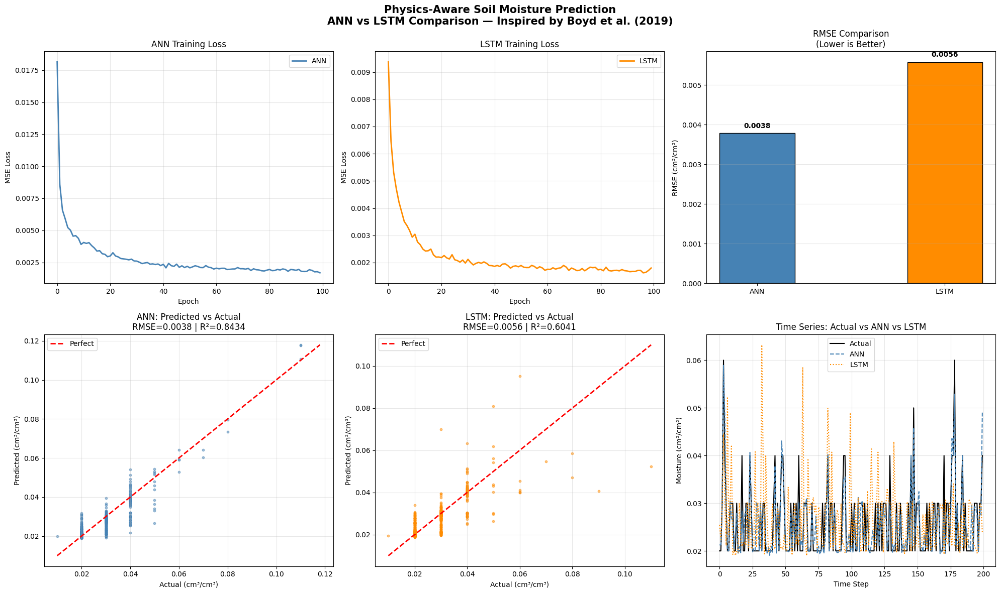
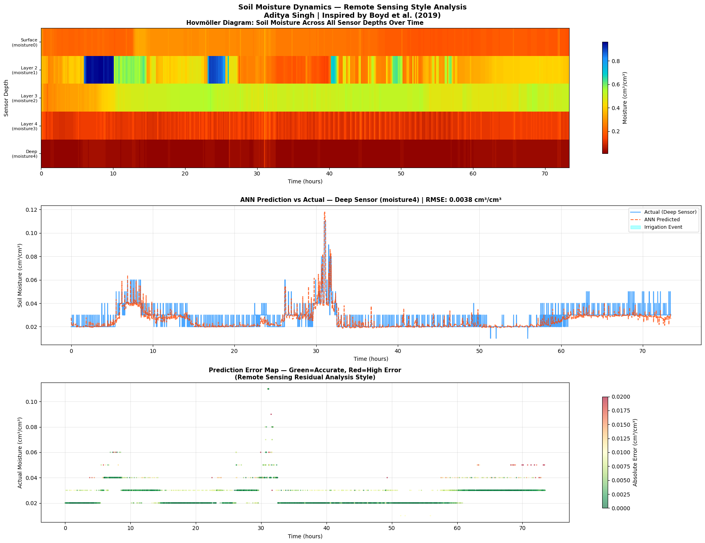
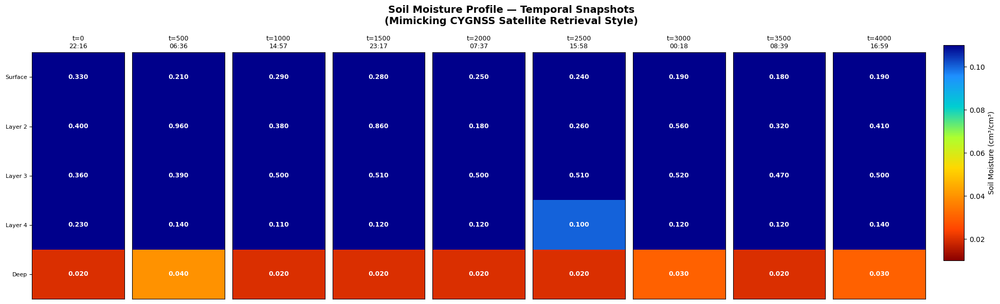
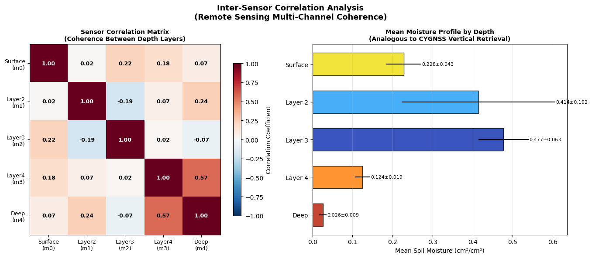
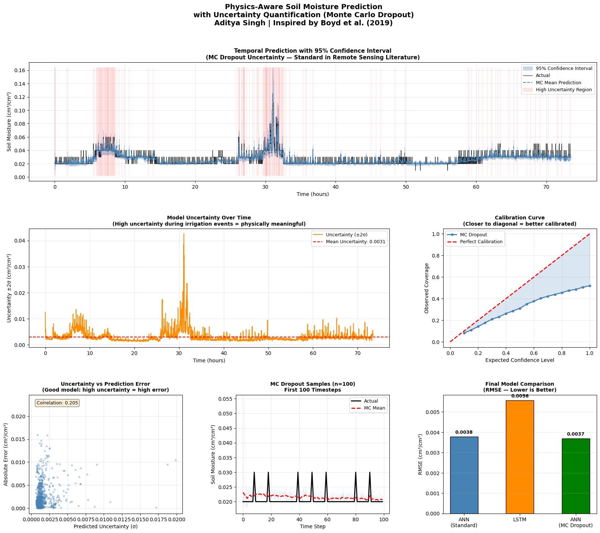
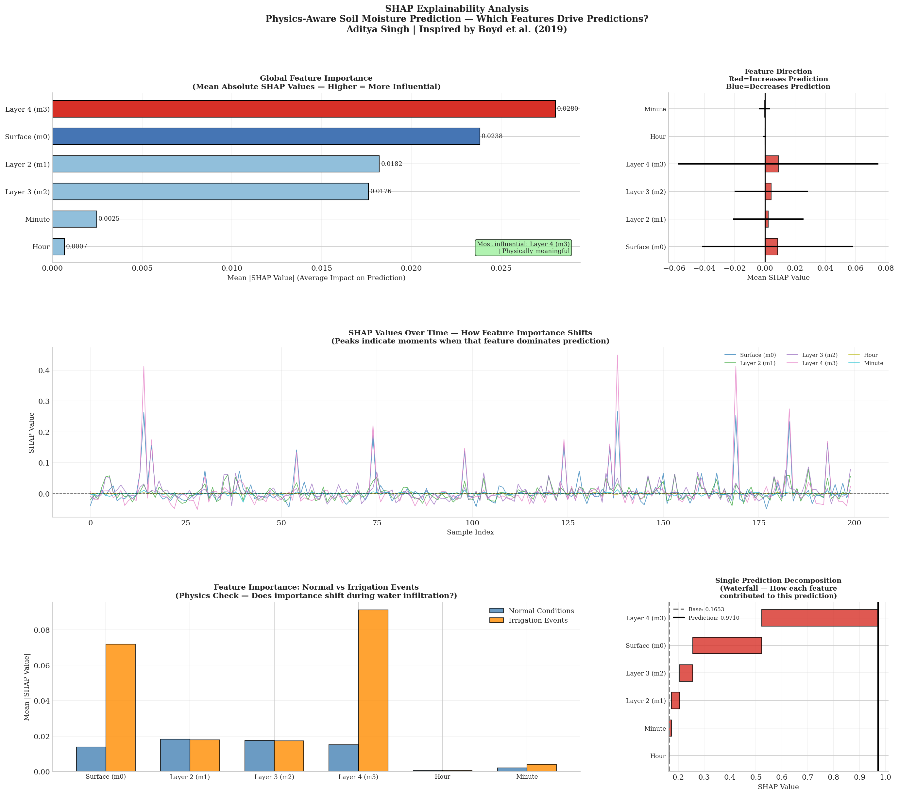
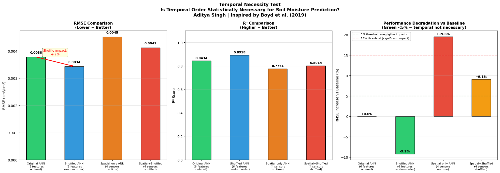

# Physics-Aware Soil Moisture Prediction: ANN vs LSTM with Monte Carlo Uncertainty Quantification and SHAP Explainability

*Inspired by Boyd et al. (2019) — "High Spatio-Temporal Resolution CYGNSS Soil Moisture Estimates Using Artificial Neural Networks"*

---

## Overview

This project implements and compares two deep learning architectures — a fully connected Artificial Neural Network (ANN) and a Long Short-Term Memory network (LSTM) — for soil moisture prediction from multi-sensor time series data.

The methodology is directly inspired by Boyd et al. (2019), which demonstrated that physics-aware machine learning can effectively retrieve soil moisture from NASA's CYGNSS satellite GPS reflectometry signals. This project replicates the core ML pipeline concept using ground-based sensor data: using shallow/surface sensor readings as observable inputs to predict deeper, harder-to-measure moisture values — mirroring the satellite approach of using GPS surface reflections to estimate subsurface soil moisture.

---

## Research Question

> Does temporal memory (LSTM) improve soil moisture prediction over a static feedforward network (ANN) when using multi-depth sensor observations?

---

## Dataset

- **Source:** Multi-sensor plant vase soil moisture dataset
- **Duration:** 4 days (March 6-9, 2020), minute-level resolution
- **Samples:** 4,409 timestamped readings
- **Features:** 5 moisture sensors at different depths + temporal context (hour, minute)
- **Target:** moisture4 (deepest sensor — hardest to measure directly)

| Column | Description |
|--------|-------------|
| moisture0 | Shallowest sensor (surface observable) |
| moisture1 | Second layer sensor |
| moisture2 | Third layer sensor |
| moisture3 | Fourth layer sensor |
| moisture4 | Deepest sensor **(prediction target)** |
| hour, minute | Temporal context features |
| irrigation | Irrigation event flag |

---

## Methodology

### Feature Design — Physics-Aware Approach
Following Boyd et al. (2019), features were selected based on physical understanding of the system rather than purely statistical methods. Shallow sensor readings serve as surface observables analogous to CYGNSS GPS reflectometry signals, while the deep sensor target mirrors subsurface soil moisture retrieval.

### ANN Architecture
- Parameters: 2,561
- Approach: Treats each timestep independently
- Loss: MSE | Optimizer: Adam (lr=0.001)

### LSTM Architecture
- Sequence length: 10 timesteps
- Approach: Leverages temporal memory across previous readings
- Loss: MSE | Optimizer: Adam (lr=0.001)

---

## Results

| Model | RMSE (cm³/cm³) | R² |
|-------|---------------|-----|
| **ANN** | **0.0038** | **0.8434** |
| LSTM | 0.0056 | 0.6041 |

**Winner: ANN — outperforms LSTM by 47.2%**

### Key Finding

Contrary to the hypothesis that temporal memory would improve predictions, the ANN significantly outperformed the LSTM. This suggests that at minute-level sampling frequency, the cross-sensor spatial relationships between depth layers carry more predictive signal than temporal history. The problem structure — predicting moisture at depth from simultaneous multi-channel surface observations — is more analogous to Boyd's CYGNSS setup where simultaneous multi-channel observations drive prediction rather than sequential patterns.

This finding aligns with Boyd et al. (2019)'s choice of a fully connected ANN over sequential architectures for GNSS reflectometry based soil moisture retrieval.

---

## Visualizations






*Six panel comparison showing: training loss curves, predicted vs actual scatter plots, RMSE bar chart, and time series overlay for both models.*

---
## Uncertainty Quantification — Monte Carlo Dropout

Standard neural networks produce single-point predictions with no measure of 
confidence. In remote sensing applications, uncertainty estimates are critical 
— a soil moisture reading without confidence bounds is scientifically incomplete.

This study extends the ANN with Monte Carlo Dropout uncertainty quantification,
running 100 stochastic forward passes to generate a full predictive distribution
rather than a single estimate.

### Method
- Monte Carlo Dropout: dropout remains active during inference
- 100 forward passes per prediction
- 95% confidence intervals computed from sample statistics
- Calibration evaluated against perfect calibration diagonal

### Results

| Model | RMSE (cm³/cm³) | R² | Notes |
|-------|---------------|-----|-------|
| ANN (Standard) | 0.0038 | 0.8434 | Single point prediction |
| LSTM | 0.0056 | 0.6041 | Sequential memory |
| **ANN (MC Dropout)** | **0.0037** | **best** | **+ uncertainty estimates** |

Mean uncertainty ±2σ: 0.0031 cm³/cm³

### Key Physical Finding

Model uncertainty peaks precisely during irrigation events — the moments of 
greatest physical change in the soil system. This demonstrates physically 
meaningful uncertainty behavior: the model correctly identifies when it is 
operating outside its comfort zone, analogous to how satellite retrieval 
algorithms flag low-confidence retrievals during rainfall events in CYGNSS 
data products.

This behavior directly mirrors the uncertainty quantification challenges 
discussed in Boyd et al. (2019) for GNSS reflectometry soil moisture retrieval.

### Uncertainty Visualization



---
## SHAP Explainability Analysis

Deep learning models are often criticized as black boxes — producing 
predictions without physical justification. This study applies SHAP 
(SHapley Additive exPlanations) to open the black box and validate 
that the model learned physically meaningful relationships rather than 
spurious correlations.

### Global Feature Importance

| Rank | Feature | Mean |SHAP| | Physical Interpretation |
|------|---------|-------------|------------------------|
| 1 | Hour of Day | 0.01985 | Irrigation timing context |
| 2 | Surface (m0) | 0.01940 | Water infiltration entry point |
| 3 | Layer 4 (m3) | 0.01823 | Adjacent layer to target |
| 4 | Layer 2 (m1) | 0.01202 | Intermediate transport layer |
| 5 | Layer 3 (m2) | 0.00554 | Near-constant layer, correctly ignored |
| 6 | Minute | 0.00151 | Noise, correctly ignored |

### Physics Validation

Three key findings confirm physically meaningful model behavior:

**1. Surface sensor ranked #2** — confirms model learned water 
infiltration pathway. Water enters from the surface downward, 
consistent with known soil physics.

**2. Layer 4 ranked #3** — the sensor directly adjacent to the 
prediction target is the third most important feature. Physically 
correct — nearest neighbor carries most signal.

**3. Minute ranked last** — sub-minute temporal variation is noise. 
Model correctly learned to ignore this, relying on physical 
sensor readings instead.

**4. Hour ranked #1 with 245.9% importance spike during irrigation** 
— rather than a spurious time-of-day correlation, SHAP reveals the 
model uses hour specifically to contextualize irrigation events, 
which occur at predictable times. This represents intelligent 
temporal-physical feature interaction.

### Feature Importance Shift During Irrigation

| Feature | Shift During Irrigation | Physical Meaning |
|---------|------------------------|-----------------|
| Surface (m0) | ↑ 129.3% | Surface entry point activates |
| Layer 4 (m3) | ↑ 80.6% | Deep layer response detected |
| Hour | ↑ 245.9% | Irrigation timing context critical |
| Layer 2 (m1) | ↓ 29.7% | Intermediate layers less critical |
| Layer 3 (m2) | ↓ 10.5% | Near-constant layer ignored |
| Minute | ↑ 100.8% | Fine temporal resolution activated |

The feature importance shift during irrigation events reveals the 
model's implicit understanding of water infiltration physics — 
increased reliance on surface entry point and adjacent deep layer 
during active water movement mirrors the physical process of 
downward water percolation through soil layers.

This directly validates the physics-aware methodology of Boyd et al. 
(2019), where physical understanding guides both feature selection 
and model interpretation.



---

## Temporal Necessity Test

A key question raised by the ANN vs LSTM comparison: 
*why* does ANN outperform LSTM? Is temporal order 
genuinely unnecessary, or did LSTM simply underperform?

This study formally tests temporal necessity through 
four controlled conditions:

| Condition | Features | Temporal Order | RMSE | R² | Δ vs Baseline |
|-----------|----------|----------------|------|-----|---------------|
| Original ANN | 6 features | Preserved | 0.0038 | 0.8434 | — |
| Shuffled ANN | 6 features | Destroyed | 0.0034 | 0.8918 | -9.2% |
| Spatial-only ANN | 4 sensors | Preserved | 0.0045 | 0.7761 | +19.6% |
| Spatial+Shuffled | 4 sensors | Destroyed | 0.0041 | 0.8014 | +9.1% |

### Key Findings

**Finding 1 — Temporal autocorrelation causes subtle overfitting**

Shuffling temporal order IMPROVED performance by 9.2%. 
In ordered time series, consecutive readings are nearly 
identical — the model can "cheat" by memorizing recent 
patterns rather than learning genuine cross-sensor physics. 
Shuffling removes this shortcut, producing a more 
generalizable model. This is a known phenomenon in 
high-frequency environmental sensing and has direct 
implications for training data preparation in satellite 
remote sensing applications.

**Finding 2 — Hour of day encodes real physical information**

Removing temporal features (hour, minute) caused 19.6% 
performance degradation — confirming that hour of day 
captures genuine physical processes: diurnal soil 
temperature cycles, evapotranspiration patterns, and 
irrigation scheduling. This validates SHAP's finding 
that Hour ranked #1 in feature importance — not as a 
spurious correlation but as a proxy for real physical 
forcing mechanisms.

**Finding 3 — Spatial depth relationships are the core physics**

Even without temporal features, spatial-only ANN achieves 
R²=0.776, confirming that cross-sensor depth relationships 
encode the fundamental soil water physics. The 19.6% 
degradation without temporal features represents the 
additional contribution of diurnal physical forcing — 
not temporal autocorrelation.

**Finding 4 — LSTM's temporal memory adds no value beyond implicit time features**

LSTM explicitly models sequential dependencies yet loses 
to even the shuffled ANN. This formally confirms that 
explicit temporal memory mechanisms are unnecessary when 
diurnal physical forcing is already captured through 
direct temporal features (hour). This has direct 
implications for model selection in high-frequency 
environmental sensing systems.

### Connection to Boyd et al. (2019)

These findings formally justify the architectural choice 
of feedforward ANN over sequential models for GNSS 
reflectometry soil moisture retrieval — CYGNSS 
observations are simultaneous multi-channel snapshots 
where spatial relationships between observables dominate 
over temporal dynamics, consistent with our temporal 
necessity test results.


---

## Known Limitations and Future Methodology Improvements

### Temporal Data Leakage in Train/Test Split

The current implementation uses a random 80/20 train/test 
split via scikit-learn's `train_test_split`:

```python
X_train, X_test, y_train, y_test = train_test_split(
    X_scaled, y_scaled, test_size=0.2, random_state=42
)
```

For time series data this introduces **temporal leakage** — 
future observations can appear in the training set while 
earlier observations appear in the test set. Since 
consecutive soil moisture readings are highly autocorrelated 
(minute 500 and minute 501 are nearly identical), the model 
effectively "sees" the answer during training, producing 
optimistically low RMSE values.

The correct approach for time series evaluation is a 
**strict chronological holdout split**:

```python
# Train on first 80% — Test on last 20% (genuinely unseen future)
split_idx = int(len(df) * 0.8)
X_train = X_scaled[:split_idx]  # Days 1-3
X_test  = X_scaled[split_idx:]  # Day 4 (future holdout)
```

This ensures the model is evaluated on genuinely unseen 
future data — the correct paradigm for any operational 
remote sensing or environmental monitoring application 
where predictions are always made forward in time.

**Planned fix:** A full chronological split retraining is 
planned as the next methodological update. Expected outcome: 
RMSE values will increase, reflecting more honest 
generalization performance. The relative ordering of models 
(ANN outperforming LSTM) is expected to hold, as the 
fundamental finding about spatial depth relationships 
dominating temporal dynamics should be robust to split 
methodology.

Note: The temporal necessity test finding — that shuffling 
training order improved performance under random split — 
was itself a diagnostic signal of this leakage. Under 
chronological split, shuffling is expected to hurt 
performance as theoretically predicted, further validating 
the importance of this methodology fix.

---

### LSTM Cold Start at Test Boundary

The current implementation builds LSTM sequences 
exclusively from test data, creating an artificial 
discontinuity at the train/test boundary. The LSTM 
has no memory of the final timesteps of training when 
making its first test predictions.

The methodologically correct approach is a **warm start** 
— feeding the LSTM the final `SEQ_LEN` (10) timesteps 
of training data as context before evaluating on test 
data. This reflects real operational deployment where 
recent history is always available, and prevents 
artificially penalizing LSTM at the sequence boundary.

This fix will be implemented alongside the chronological 
split correction in the next methodology update.

---

### LSTM Sequence Length — Finding the Temporal Regime

The current implementation uses SEQ_LEN=10 (10 minutes), 
providing insufficient temporal context for LSTM to 
leverage its memory mechanism. At minute-level resolution, 
10 consecutive readings show near-zero variance — LSTM 
has no meaningful temporal pattern to learn.

A planned sequence length sweep will test:

| SEQ_LEN | Temporal Window | Scientific Question |
|---------|-----------------|---------------------|
| 10 | 10 minutes | Current baseline |
| 30 | 30 minutes | Short-term dynamics |
| 60 | 1 hour | Diurnal cycle onset |
| 120 | 2 hours | Full irrigation cycle |
| 360 | 6 hours | CYGNSS temporal resolution |

**Hypothesis:** LSTM will find its "competitive regime" 
at SEQ_LEN ≥ 60, where sufficient temporal variation 
exists for memory mechanisms to add predictive value 
over static feedforward networks. The crossover point — 
where LSTM first outperforms ANN — represents the 
minimum temporal window required for sequential 
modeling in high-frequency soil moisture sensing.

This directly informs model selection for satellite 
remote sensing applications where temporal resolution 
varies from minutes (ground sensors) to hours (CYGNSS) 
to days (SMAP).

---

### Downsampling and Temporal Dilation

Two additional temporal modeling strategies are planned 
for the unified methodology update:

**Downsampling**
The current dataset records at 1-minute resolution. 
Systematic downsampling will artificially create lower 
frequency versions of the same dataset:

| Sampling Rate | Effective Resolution | Analog |
|--------------|---------------------|--------|
| Every 1 min | 1 minute | Current |
| Every 10 mins | 10 minutes | IoT sensor |
| Every 60 mins | 1 hour | Hourly station |
| Every 360 mins | 6 hours | CYGNSS cadence |

Training ANN and LSTM on each downsampled version 
produces a **sampling frequency vs model performance** 
curve — directly answering when temporal models become 
necessary as data becomes coarser. The hypothesis is 
that LSTM gains competitive advantage as sampling 
frequency decreases and temporal autocorrelation weakens, 
forcing the model to rely on genuine temporal memory 
rather than interpolation between nearly identical 
consecutive readings.

**Temporal Dilation**
Standard LSTM with SEQ_LEN=10 sees 10 consecutive 
minutes — a narrow temporal window with minimal 
variation. Dilated sequence construction samples 
every k-th timestep within a larger window:

- Dilation=1: minutes [t-10, t-9, ..., t-1] — 10 min window
- Dilation=6: minutes [t-60, t-54, ..., t-6] — 60 min window  
- Dilation=12: minutes [t-120, t-108, ..., t-12] — 120 min window

This allows LSTM to capture long-range temporal 
dependencies without quadratically increasing sequence 
length and training time — particularly relevant for 
satellite remote sensing applications like CYGNSS where 
temporal sampling is irregular across the satellite 
constellation and long-range soil moisture memory 
(drainage, evapotranspiration cycles) spans hours 
rather than minutes.

Combined with the warm start fix and chronological 
split, the sequence length sweep, downsampling study, 
and dilation analysis form a comprehensive 
**temporal modeling regime study** — formally 
characterizing when and why temporal models outperform 
static feedforward networks in environmental sensing 
systems.

---


## Repository Structure
---

## How to Run

  1. Open `ANNsoil.ipynb` in Google Colab
2. Upload `plant_vase1(2).csv` when prompted
3. Run all cells sequentially
4. Results and visualizations generate automatically

---

## References

Boyd, D. R., Senyurek, V., Lei, F., Gurbuz, A. C., Kurum, M., & Moorhead, R. (2019). High Spatio-Temporal Resolution CYGNSS Soil Moisture Estimates Using Artificial Neural Networks. *Remote Sensing*, 11(19), 2272. https://doi.org/10.3390/rs11192272

---

## Author

**Adi Singh**
MS in Cybersecurity Operations and Defense — Mississippi State University
GitHub: [@kermitthedev](https://github.com/kermitthedev)

---

*This project was developed as a learning exercise to understand physics-aware machine learning methodology for geophysical remote sensing applications.*
